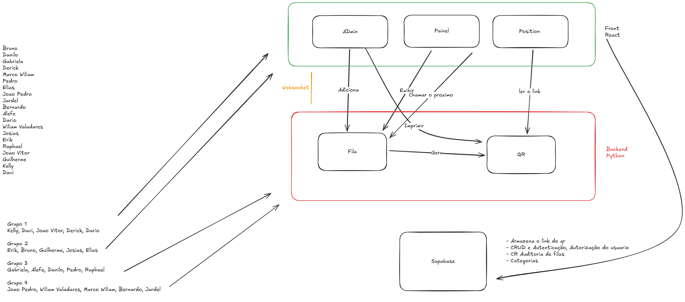

# Gerenciador de Fila - ACE 5

Projeto acadêmico para gestão de filas em postos de saúde, com interface web, backend em Python e persistência em Supabase.



---

## Objetivo

Construir um sistema de filas com atualização em tempo real para:

- Cadastro de pessoas na fila
- Exibição da fila em painel público
- Chamada do próximo atendimento
- Geração e leitura de QR para acesso rápido

---

## Arquitetura (com base no diagrama)

### Frontend (React)

Aplicação separada em três visões principais:

- **Admin:** adiciona pessoas na fila e aciona a impressão/geração de QR
- **Painel:** exibe a fila e permite chamar o próximo
- **Position:** lê o link do QR e direciona para a informação da posição na fila

### Backend (Python)

Camada responsável pelas regras de negócio e integração entre tela e dados:

- **Fila:** controla entrada, ordenação e chamada de atendimentos
- **QR:** gera e resolve links de acesso por QR code

### Comunicação em tempo real

WebSocket entre frontend e backend para manter as telas sincronizadas em tempo real.

### Banco e serviços (Supabase)

Uso planejado do Supabase para:

- Armazenar o link do QR
- CRUD de autenticação e autorização de usuários
- CR (consulta e registro) de auditoria das filas
- Gerenciamento de categorias

---

## Fluxo principal

1. Admin adiciona uma pessoa na fila.
2. Backend registra a entrada e atualiza os dados.
3. Painel exibe a fila atualizada em tempo real.
4. Painel chama o próximo da fila.
5. Backend atualiza o estado e gera/resolve QR quando necessário.
6. Position lê o link e mostra a posição correspondente.

---

## Equipe

Bruno, Danilo, Gabriela, Derick, Marco Wiliam, Pedro, Elias, Joao Pedro, Jardel, Bernardo, Alefe, Dario, Wiliam Valadares, Josias, Erik, Raphael, Joao Vitor, Guilherme, Kelly, Davi

### Organização dos grupos

| Grupo | Membros | Área |
|---|---|---|
| Grupo 1 | Kelly, Davi, Joao Vitor, Derick, Dario | Frontend |
| Grupo 2 | Erik, Bruno, Guilherme, Josias, Elias | Frontend |
| Grupo 3 | Gabriela, Alefe, Danilo, Pedro, Raphael | Backend |
| Grupo 4 | Joao Pedro, Wiliam Valadares, Marco Wiliam, Bernardo, Jardel | Backend |

---

## Estrutura do repositório

```
.
├── backend/
├── frontend/
├── image.png
└── README.md
```

---

## Próximos passos sugeridos

1. Inicializar o frontend React com as três telas (Admin, Painel, Position).
2. Estruturar o backend Python com endpoints e canal WebSocket.
3. Configurar projeto Supabase (auth, tabelas de fila, auditoria e categorias).
4. Implementar fluxo completo de QR code (geração, armazenamento e leitura).